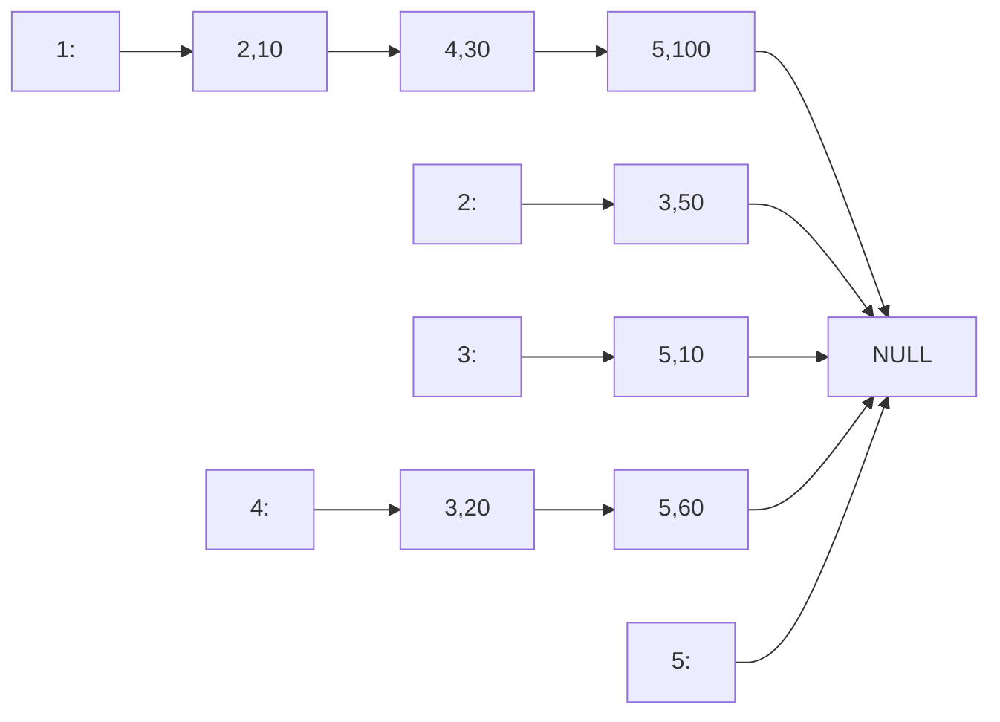

## 一、函数递归的应用

**函数不断调用自身，在符合某些条件下停止**

**递归极其占用空间，不推荐用其代替迭代**

### 1、斐波那契数列

斐波那契数列，1、1、2、3、5、8、13、21、34，F(n)=F(n-1)+F(n-2)，前两项均为1

兔子繁殖问题即为该数列的应用

```c++
#include <iostream>
#include <stdio.h>
#include <algorithm>

using namespace std;

int fib(int n) {//第n个数
	if (n <= 2)
		return 1;
	else
		return fib(n - 1) + fib(n - 2);//递归实现
}

int main() {
	int sum;
	cout << "数列前几位：";
	cin >> sum;
	for (int i = 1; i <= sum; i++) {
		cout << i << "位：" << fib(i) << endl;
	}
	return 0;
}
```

### 2、阶乘的递归实现

效率极低，只是为了展示例子，没什么实用价值

```c++
#include <iostream>
#include <stdio.h>
#include <algorithm>

using namespace std;

int fac(int n) {
    if (n <= 1)
        return n;
    else
        return n * fac(n - 1);
}

int main() {
    int sum;
    cout << "输入前几位：";
    cin >> sum;
    for (int i = 1; i <= sum; i++) {
        cout << i << "阶乘：" << fac(i) << endl;
    }
    return 0;
}
```

### 3、汉诺塔

当64片圆盘移动位置，世界的终结进入倒计时

每次移动时，将上面n-1个盘子看成整体，相当于每次移动两个盘子

```c++
#include <iostream>
#include <stdio.h>
#include <algorithm>

using namespace std;

void move_plate(int n, char x, char y, char z) {//将n个盘子从x借助y移动到z
    if (n == 1) {//一个盘子随便动
        cout << n << "：" << x << "-->" << z << endl;
    } else {//n-1个盘子，去除了最下面的盘子
        move_plate(n - 1, x, z, y);//将n-1个盘子从x借助z移动到y
        cout << n << "：" << x << "-->" << z << endl;//最下面盘子放好
        move_plate(n - 1, y, x, z);//将n-1个盘子从y借助x移动到z
    }
}

int main() {
    cout << "输入汉诺塔层数；";
    int n;
    cin >> n;
    move_plate(n, 'x', 'y', 'z');//盘子从上到下编号递增
    return 0;
}
```

### 4、二分查找

二分法查找前需有序，效率高于迭代

```c++
#include <iostream>
#include <stdio.h>
#include <algorithm>

using namespace std;

int num[101];

int fib(int n) {//第n个数
    if (n == 0)
        return 0;
    else if (n == 1)
        return 1;
    else
        return fib(n - 1) + fib(n - 2);//递归实现
}

int get_index(int n, int begins, int ends) {
    if (begins >= ends && num[begins] != n)//该数不存在
        return -1;
    if (num[(begins + ends) / 2] == n)
        return (begins + ends) / 2;
    else if (num[(begins + ends) / 2] > n)
        return get_index(n, begins, (begins + ends) / 2 - 1);
    else
        return get_index(n, (begins + ends) / 2 + 1, ends);
}

int main() {
    cout << "斐波那契数列：" << endl;
    for (int i = 1; i <= 15; i++) {
        num[i] = fib(i);
        cout << num[i] << " ";
    }
    cout << endl << "查找：";
    int n;
    cin >> n;
    cout << "该数：" << get_index(n, 1, 15) << endl;
    return 0;
}
```

### 5、DFS相关

其实所有的深度优先搜索都采用了递归思想，可见（三）

## 二、排序算法

### 0、一些概念描述

**排序的稳定性：原序列中相等的两个数在排序后相对位置不变则稳定，否则不稳定。**

**排序方式：Out_place指需要借助其他的数据结构存储排序结果，借助的数据结构和问题规模有关，排序结束后为原数据结构重新赋值；In_place指不需要借助其他数据据结构，原数据排序完毕后可直接输出结果**

**最好情况往往在数据刚好顺序时产生，最坏情况在数据刚好逆序时产生**

| 排序算法 |  平均时间复杂度  |     最好情况     |     最坏情况     | 稳定性 | 排序方式  |
| :------: | :--------------: | :--------------: | :--------------: | :----: | :-------: |
|  桶排序  |      O(n+k)      |      O(n+k)      | O(n<sup>2</sup>) |  稳定  | Out_place |
| 选择排序 | O(n<sup>2</sup>) | O(n<sup>2</sup>) | O(n<sup>2</sup>) | 不稳定 | In_place  |
| 冒泡排序 | O(n<sup>2</sup>) |       O(n)       | O(n<sup>2</sup>) |  稳定  | In_place  |
| 快速排序 |     O(nlogn)     |     O(nlogn)     | O(n<sup>2</sup>) | 不稳定 | In_place  |
|  堆排序  |     O(nlogn)     |     O(nlogn)     |     O(nlogn)     | 不稳定 | In_place  |
| 插入排序 | O(n<sup>2</sup>) |       O(n)       | O(n<sup>2</sup>) |  稳定  | In_place  |
| 希尔排序 |     O(nlogn)     |       O(n)       | O(n<sup>2</sup>) | 不稳定 | In_place  |
| 归并排序 |                  |                  |                  |        |           |
| 计数排序 |                  |                  |                  |        |           |
| 基数排序 |                  |                  |                  |        |           |

### 1、桶排序

$$
稳定的排序算法，时间复杂度O(n)
$$

也叫箱排序，**桶可以是很多概念，比如数组、链表、队列等，概念太大，不常用**

**排序前需得知数据的范围，无法为小数排序，空间复杂度极高，不是比较排序**

为每个数据规定一个桶，该桶只能放入数值特定的数据，将所有数据依次入桶，最后按照每个桶所代表的数据数值有次序的（升序或降序）输出桶内的该数据

```c++
#include <iostream>
#include <algorithm>
#include <stdio.h>

using namespace std;

#define SUM 101

int main() {
    int n;
    cout << "一共几个数：";
    cin >> n;
    int num[101];
    cout << "输入数据：";
    for (int i = 1; i <= n; i++) {
        cin >> num[i];
    }
    int book[SUM] = { 0 }; //存储数据的桶，索引即为数据值
    for (int i = 1; i <= n; i++) {//进行排序
        book[num[i]]++; //对应的桶放入一个数
    }
    int index = 1;
    for (int i = 1; i <= SUM; i++) { //升序
        for (int a = 1; a <= book[i]; a++) {
            num[index] = i;
            cout << num[index++] << " ";
        }
    }
    return 0;
}
```

### 2、选择排序

$$
不稳定的排序算法，时间复杂度O(n^2)
$$

也叫直接选择排序

每次排序时寻找当前位置的正确数据，共需寻找n-1次

```c++
#include <iostream>
#include <algorithm>
#include <stdio.h>

using namespace std;

int main() {
	int n;
	cout << "输入数据个数：";
	cin >> n;
	int num[101] = { 0 };
	cout << "输入数据：";
	for (int i = 1; i <= n; i++) {
		cin >> num[i];
	}
	for (int i = 1; i <= n - 1; i++) {//每次寻找第i个位置的数
		int temp = i;
		for (int j = i + 1; j <= n; j++) {//从n-i里面寻找
			if (num[temp] > num[j]) {//升序排序
				temp = j;
			}
		}
		if (temp != i) {
			swap(num[i], num[temp]);//交换两个位置的数
		}
	}
	for (int i = 1; i <= n; i++) {
		cout << num[i] << " ";
	}
	return 0;
}
```

### 3、冒泡排序

$$
稳定的排序算法，时间复杂度O(n^2)
$$

也叫起泡排序，排序界的祖师爷，也是每次确定一个位置的值，只是每次找到想要的数即交换，不等到每次循环最后了，但这样使排序变的稳定。**最好情况是数据本身就有序，大循环只循环一次，内循环循环n-1次**

```c++
#include <iostream>
#include <algorithm>
#include <stdio.h>

using namespace std;

int main() {
	int n;
	cout << "输入数据个数：";
	cin >> n;
	int num[101] = { 0 };
	cout << "输入数据：";
	for (int i = 1; i <= n; i++) {
		cin >> num[i];
	}
	for (int i = 1; i <= n - 1; i++) {//开始排序，也为每次确定一个数的位置
		bool flag = false;//是否需要继续排序，用于优化
		for (int j = i + 1; j <= n; j++) {
			if (num[i] > num[j]) {//升序，找到即交换，不等到每次循环最后了
				swap(num[i], num[j]);
				flag = true;
			}
		}
		if (!flag)//说明原数据本身有序
			break;
	}
	for (int i = 1; i <= n; i++) {
		cout << num[i] << " ";
	}
	return 0;
}
```

### 4、快速排序

$$
不稳定的排序算法，时间复杂度O(nlogn)
$$

每次排序也是确定一个数的具体位置，将准基数归位成为基数，其左边的数都比它小(大)，右边的数都比它大(小)，从所有数据的两边遍历寻找不符合该条件的数进行交换

**注意最开始寻找的位置必须与准基数位置相对。**这也是为了保证基数左侧的数比基数小，右侧的数比基数大(如果升序排序的话)，若是违反该规则，每次i所定位的数肯定比基数大，再与基数交换就**炸了**(除非降序排序)

**快排是目前最常用的排序算法，基数也叫主元**

```c++
#include <iostream>
#include <algorithm>
#include <stdio.h>

using namespace std;

int n;
int num[101];

void quicksort(int left, int right) {//每次调用函数确定一个数的位置
	if (left > right) {//说明该部分已排序完
		return;
	}
	int ready_data = num[left];//左侧数为基数
	int i = left;//左
	int j = right;//右
	while (i != j) {//左右未相遇时
		while (num[j] >= ready_data && i < j) {//左侧为准基数，先从右侧找
			j--;
		}
		while (num[i] <= ready_data && i < j) {//后从左侧找
			i++;
		}
		if (i < j) {//若未相遇，则交换
			swap(num[i], num[j]);
		}
	}
	//此时i==j
	num[left] = num[i];//仅仅为了防止数据流失
	//准基数找到了它应该在的位置i，成为正式的基数，左边都比它小，右边都比它大
	num[i] = ready_data;
	quicksort(left, i - 1);//分治思想
	quicksort(i + 1, right);
}

int main() {
	cout << "输入数据个数：";
	cin >> n;
	cout << "输入数据：";
	for (int i = 1; i <= n; i++) {
		cin >> num[i];
	}
	quicksort(1, n);
	for (int i = 1; i <= n; i++) {
		cout << num[i] << " ";
	}
	return 0;
}
```

多说一句，Java的sort排序采用改进的快速排序。C++的sort排序也是快速排序，但在二分后会若数据量小于某个值则该部分数据采用插入排序，若数据的排序递归程度太深了则该部分数据采用堆排序，也就是说**C++sort函数的算法为快速排序为主，插入排序和堆排序为辅**

### 5、堆排序

$$
不稳定的排序算法，时间复杂度总为O(nlogn)
$$

该排序依靠数据结构——堆，**最小堆(最大堆)的堆顶一定为当前堆内最小(最大)的数**

**堆是一棵完全二叉树，可用一维数组存储。num[i]的父亲为num[i/2]、左儿子为num[i\*2]、右儿子为num[i\*2+1]**

**最小堆也叫小根堆，最大堆也叫大根堆**

先生成最小堆(最大堆)，堆顶与堆尾交换后重新维护堆，如此往复直至堆空

```c++
#include <iostream>
#include <algorithm>
#include <stdio.h>

using namespace std;

int Heap_size;
int Heap[101];

void siftdown(int i) {//向下调整
	bool flag = true;//位置是否正确
	//生成最小堆
	while (i * 2 <= Heap_size && flag) {
		int temp;
		//寻找父亲、两个儿子中最小的数
		if (Heap[i] > Heap[i * 2]) {//判断左儿子
			temp = i * 2;
		} else {
			temp = i;
		}
		if (i * 2 + 1 <= Heap_size) {//判断是否有右儿子
			if (Heap[temp] > Heap[i * 2 + 1]) {//判断右儿子
				temp = i * 2 + 1;
			}
		}
		if (temp != i) {//如果父亲位置确实不对
			swap(Heap[i], Heap[temp]);
			i = temp;//父亲变儿子了
		} else {//变为儿子后仍有可能位置不对
			flag = false;
		}
	}
}

void sort_My_Heap() {//堆排序
	const int const_size = Heap_size;
	for (int i = 1; i <= const_size; i++) {
		swap(Heap[1], Heap[Heap_size--]);//堆顶放入最后，最小堆导致降序
		siftdown(1);//重新维护堆
	}
}

int main() {
	cout << "输入数据个数：";
	cin >> Heap_size;
	cout << "输入数据：";
	for (int i = 1; i <= Heap_size; i++) {
		cin >> Heap[i];
	}
	for (int i = Heap_size / 2; i >= 1; i--) {//生成最小堆
		siftdown(i);
	}
	cout << "----------------最小堆----------------" << endl;
	for (int i = 1; i <= Heap_size; i++) {
		cout << Heap[i] << " ";
	}
	cout << endl << "----------------堆排序----------------" << endl;
	const int const_size = Heap_size;
	sort_My_Heap();//最小堆导致降序
	for (int i = 1; i <= const_size; i++) {
		cout << Heap[i] << " ";
	}
	return 0;
}
```

多说一句，C++STL中有构造堆和堆排序的算法

**make_heap()，构造堆默认为最大堆**

**sort_heap()，堆排序，排序的数必须为合法的最小堆或最大堆，排序函数需与构造时相同**

**pop_heap()，将堆顶的元素与堆尾互换后重新维护堆，必须为合法的最小堆或最大堆**

```c++
#include <iostream>
#include <algorithm>
#include <stdio.h>

using namespace std;

int Heap_size;
int Heap[101];

int main() {
	cout << "输入数据个数：";
	cin >> Heap_size;
	cout << "输入数据：";
	for (int i = 1; i <= Heap_size; i++) {
		cin >> Heap[i];
	}
	make_heap(Heap + 1, Heap + 1 + Heap_size);//默认为最大堆，less<int>{}
	cout << "----------------最大堆----------------" << endl;
	for (int i = 1; i <= Heap_size; i++) {
		cout << Heap[i] << " ";
	}
	cout << endl << "----------------堆排序 ----------------" << endl;
	sort_heap(Heap + 1, Heap + 1 + Heap_size);//最大堆导致升序
	for (int i = 1; i <= Heap_size; i++) {
		cout << Heap[i] << " ";
	}
	return 0;
}
```

### 6、插入排序

$$
稳定的排序算法，时间复杂度O(n^2)
$$

也叫直接插入排序，和选择、冒泡类似，但效率往往更高

**将一个数据放入某个有序数列中的恰当位置，依次重复所有待排序数据**

**迭代数据，若某一数据不符合升序(降序)规则，向前寻找它应在的位置**

```c++
#include <iostream>
#include <algorithm>
#include <stdio.h>

using namespace std;

int n;
int num[101];

int main() {
	cout << "输入数据个数：";
	cin >> n;
	cout << "输入数据：";
	for (int i = 1; i <= n; i++) {
		cin >> num[i];
	}
	for (int i = 1; i <= n - 1; i++) {
		if (num[i + 1] < num[i]) {//若不符合升序
			int j = i;
			int wrong_data = num[i + 1];//不在正确位置的数据
			while (wrong_data < num[j] && j>0) {//寻找该数据应该的位置，注意数组越界问题
				num[j + 1] = num[j];//数据后移，为该数据预留位置
				j--;
			}
			num[j + 1] = wrong_data;//找到了正确位置j+1，此时num[j]>=wrong_data，稳定的排序
		}
	}
	for (int i = 1; i <= n; i++) {
		cout << num[i] << " ";
	}
	return 0;
}
```

### 7、希尔排序

$$
不稳定的排序算法，时间复杂度O(nlogn)
$$

划时代的排序算法，终结了人们认为内排序时间最快O(n<sup>2</sup>)的误区，也叫缩小增量排序

**是对直接插入排序的改进，将数据依据增量分组后进行插入排序。分组方法为每间隔一特定数的数据的所有数据为一组，间隔的数据个数为增量，每次排序完后重取更小的增量继续排序**

最初shell提出取增量increment=n/2向下取整，直到increment=1。但由于直到最后一步，在奇数位置的元素才会与偶数位置的元素进行比较，这样效率会很低。**后来Knuth提出取increment=n/3向下取整后+1**.还有人提出都取奇数为好，也有人提出increment互质为好。**应用不同的增量变化方法会使希尔排序算法的性能有很大的差异**

```c++
#include <iostream>
#include <algorithm>
#include <stdio.h>

using namespace std;

int n;
int num[101];

int main() {
	cout << "输入数据个数：";
	cin >> n;
	cout << "输入数据：";
	for (int i = 1; i <= n; i++) {
		cin >> num[i];
	}
	int increment = n;//增量
	while (increment > 1) {
		increment = increment / 3 + 1;//增量变化取值极大的影响了排序效率
		for (int i = increment; i <= n - 1; i++) {
			if (num[i + 1] < num[i - increment + 1]) {//若不符合升序
				int j = i - increment + 1;
				int wrong_data = num[i + 1];//不在正确位置的数据
				while (wrong_data < num[j] && j>0) {//寻找该数据应该的位置，注意数组越界问题
					num[j + increment] = num[j];//数据后移，为该数据预留位置
					j -= increment;//注意增量
				}
				num[j + increment] = wrong_data;//找到了正确位置j+increment
			}
		}
	}
	for (int i = 1; i <= n; i++) {
		cout << num[i] << " ";
	}
	return 0;
}
```

### 8、归并排序


### 9、计数排序


### 10、基数排序


## 三、查找算法

**静态查找：查找过程中数据集合不会发生变化**

**动态查找：查找过程中数据集合会发生变化，例如数据中某一元素在查找过程中被删除或插入新元素**

### 1、线性表查找

没什么可看的，都会

#### 1.1 顺序查找

线性查找，从头遍历数据集合直到找到查找值，没有则返回对应的不存在符号

```c++
int find_data(int* num, int n, int goal_data) {
	for (int i = 1; i <= n; i++) {
		if (num[i] == goal_data) {
			return i;
		}
	}
	return -1;//-1为不存在标记
}
```

#### 1.2 比例查找

例如二分查找，比例就是1:1

```c++
#include <iostream>
#include <algorithm>
#include <stdio.h>

using namespace std;

int num[8] = { 0,1,5,6,7,21,99,102 };//以该数组为查找集合，注意有序
int goal_data;

int find_data(int begins, int ends) {
	if (begins >= ends && num[begins] != goal_data)
		return -1;
	if (num[(begins + ends) / 2] == goal_data)
		return (begins + ends) / 2;
	else if (num[(begins + ends) / 2] > goal_data)
		return find_data(begins, (begins + ends) / 2 - 1);
	else
		return find_data((begins + ends) / 2 + 1, ends);
}

int main() {
	cout << "输入查找的数：";
	cin >> goal_data;
	cout << "返回了：" << find_data(0, 7) << endl;
	return 0;
}
```

其实应该自定义比例，1:1只是最常用的比例。**查找前必须有序**

#### 1.3 索引查找

普通数组通过下标访问元素就是该思想的应用，建立一个数据结构存储待查找数据集合中每个元素的位置

**还有分块索引，建立一个数据结构，存储待查找数据集合的划分中每一块的最大元素值，这样在查找某一元素时就可以根据块中最大值确定在哪个块中查找，大大提高查找效率**

### 2、树结构查找


## 四、深度优先搜索

### 1、定义和理解

&emsp;&emsp;John E.Hopcroft和Robert E.Tarjan于1971年研究图的连通性和平面性时发明了该算法。

&emsp;&emsp;深度优先搜索属于图算法的一种，英文缩写为DFS即Depth First Search.其过程简要来说是对每一个可能的分支路径深入到不能再深入为止，而且每个结点只能访问一次。

&emsp;&emsp;**每次一条路走到黑，直到满足回退的条件后返回上一个结点，若该结点有其他可走分支则继续搜索分支，否则返回直到返回的结点有其他分支可继续搜索为止。**

&emsp;&emsp;**在搜索过程中，有时会通过一些条件判断某条路径是否可搜索，该操作称为剪枝**

### 2、应用

#### 2.1 全排列

输入一个数，获取它的所有全排列组合

```c++
#include <iostream>
#include <stdio.h>
#include <algorithm>

//相当于有n个盒子，每个盒子放一个数，有几种放法
//采用递归，深度优先搜索的基本模型

using namespace std;

int box[10], book[10]={0}, n;//book用来标记当前数是否放置

void dfs(int step) {//放置第step个盒子
    if(step == n + 1) {//如果这是第n+1个盒子，则已放好，输出即可
        for(int i = 1; i <= n; i++) {//输出一个全排列
            cout << box[i];
        }
        cout << endl;
        return;//返回调用该函数的代码块，可有可无
    }
    for(int i = 1; i <= n; i++) {
        if(book[i] == 0) {//当前数未放置
            box[step] = i;
            book[i] = -1;//该数已放置
            dfs(step + 1);//继续放下一个盒子，main调用的dfs中，每次该递归均会确定一个全排列
            book[i] = 0;//接上句，所以该数重置
        }
    }
    return;//返回调用该函数的代码块
}

int main() {
    cin >> n;
    dfs(1);
    return 0;
}
```

#### 2.2 图的DFS遍历(过家家版)

```c++
#include <iostream>
#include <stdio.h>
#include <algorithm>

//邻接矩阵存储图

using namespace std;

int My_Map[21][21] = { 0 }, book[21] = { 0 };//book标记，0该店未遍历，1已遍历
int n, sum = 0;

void dfs(int step) {//当前处于编号为step的点
	cout << step << " ";
	sum++;
	if (sum == n) return;//已遍历完所有点
	for (int i = 1; i <= n; i++) {
		if (My_Map[step][i] == 1 && book[i] == 0) {
			book[i] = 1;
			dfs(i);//继续走，直到黑屋再回来
		}
	}
	return;
}

int main() {
	cout << "输入邻接矩阵行列数：";
	cin >> n;
	cout << "输入邻接矩阵：" << endl;
	for (int a = 1; a <= n; a++) {
		for (int b = 1; b <= n; b++) {
			cin >> My_Map[a][b];
		}
	}
	book[1] = 1;
	cout << "DFS遍历顺序为：";
	dfs(1);
	return 0;
}
```

#### 2.3 八皇后问题

8×8的国际象棋棋盘上摆下8个皇后，要求各皇后之间不能互相攻击。每个皇后的攻击范围为本行、本列、本主对角线、本副对角线。问有几种摆法，答案为92种，这个问题弄死了高斯

可知每个皇后各占一行，一列。矩阵中同一主对角线的元素行数差等于列数差，同一副对角线的元素行数差加列数差等于0

```c++
#include <iostream>
#include <stdio.h>
#include <algorithm>

//其实本质是回溯

using namespace std;

int chess[9][9], queen[9], sum = 0;//皇后数组下标为该皇后所站行数，值为所站列数

bool can_place(int row, int column) {//row行，column列能否放置皇后
    for(int i = 1; queen[i] != 0; i++) {//i为已站好皇后行数，queen[i]为他们所在列数
        if(column == queen[i] || row - i == column - queen[i] 
           || row - i + column - queen[i] == 0) {
            return false;//同一列、同一主对角线、同一副对角线均不可
        }
    }
    return true;
}

void place_queen(int row) {//在第row行放置第row个皇后
    if(row == 9) { //八个皇后已放置完毕
        cout << "第" << ++sum << "种：" << endl;
        for(int a = 1; a < 9; a++) {
            for(int b = 1; b < 9; b++) {
                cout << chess[a][b] << " ";
            }
            cout << endl;
        }
        cout << endl;
        return;//该句可有可无，提高一丢丢效率吧
    }
    for(int column = 1; column <= 8; column++) {
        if(can_place(row, column)) {
            queen[row] = column;
            chess[row][column] = 1;//0表示该位置无皇后，1表示有皇后
            place_queen(row + 1);//每次调用该递归会确定一种八皇后的站法
            chess[row][column] = 0;//接上句，确定一种站法后需要归零
            queen[row] = 0;
        }
    }
    return;
}

int main() {
    place_queen(1);
    cout << sum << endl;
    return 0;
}
```

#### 2.4 DFS两点间最短路径

利用深度优先搜索，可寻找一点到另一点的最短路径

```c++
#include <iostream>
#include <stdio.h>
#include <algorithm>

//以下路径不走重复的点

using namespace std;

int My_Map[21][21] = { 0 }, book[21] = { 0 };//book标记，0该店未遍历，1已遍历
int n, the_min = 9999999;

void dfs(int step, int dis, string str) {//当前处于编号为step的点，已经走过了dis长度，str存储走过的点
	if (step == n) {
		if (dis < the_min) the_min = dis;
		cout << str << " :" << dis << endl;
		return;
	}
	if (dis > the_min) return;//可加入优化算法
	for (int i = 1; i <= n; i++) {
		if (My_Map[step][i] > 0 && book[i] == 0) {
			book[i] = 1;
			dfs(i, dis + My_Map[step][i], str + "->" + to_string(i));
			book[i] = 0;
		}
	}
	return;
}

int main() {
	cout << "输入邻接矩阵行列数：";
	cin >> n;
	cout << "输入邻接矩阵：" << endl;
	for (int a = 1; a <= n; a++) {
		for (int b = 1; b <= n; b++) {
			cin >> My_Map[a][b];
		}
	}
	cout << "输入目的地：";
	cin >> n;
	cout << "所有路径：" << endl;
	book[1] = 1;//不会走重复的点
	dfs(1, 0, "1");
	cout << "最短为：" << the_min << endl;
	return 0;
}

```

#### 2.5 DFS走迷宫

DFS也可走迷宫，寻找起点到出口的最短路径

```c++
#include <iostream>
#include <stdio.h>
#include <algorithm>

using namespace std;

int row, column, p, q, the_min = 9999;//迷宫行、列，目标所在行、列
int maze[21][21], book[21][21];//book用来标记当前位置是否走过

void dfs(int x, int y, int step) {//当前处于x行，y列，已经走了step步
    if(x == p && y == q) {//如果找到了目标
        if(step < the_min) {
            the_min = step;
        }
        return;
    }
    int next[4][2] = { {0, 1}, {1, 0}, {0, -1}, {-1, 0}};//向右、下、左、上走的坐标变化
    for(int i = 0; i < 4; i++) {
        int tx = x + next[i][0];
        int ty = y + next[i][1];
        if(tx < 1 || tx > row || ty < 1 || ty > column || maze[tx][ty] == 1 
           || book[tx][ty] == 1)
            continue;//触碰边界或碰到障碍物或已经走过，0无障碍物，1有障碍物
        book[tx][ty] = 1;//标记当前已走过
        dfs(tx, ty, step + 1);//走下一步，每次调用该递归会确定一种走法
        book[tx][ty] = 0;//接上句，回到原地
    }
    return;
}

int main() {
    cout << "输入迷宫的行和列：";
    cin >> row >> column;
    cout << "初始化迷宫：" << endl;
    for(int a = 1; a <= row; a++) {
        for(int b = 1; b <= column; b++) {
            cin >> maze[a][b];
        }
    }
    int startx, starty;
    cout << "输入入口：";
    cin >> startx >> starty;
    cout << "输入目标：";
    cin >> p >> q;
    book[startx][starty] = 1;
    dfs(startx, starty, 0);
    cout << "最小步数为：" << the_min << endl;
    return 0;
}
```

#### 2.6 马踏棋盘

也叫骑士周游问题，**回溯算法的典型应用**

**在8×8的国际象棋棋盘中，马字棋怎样能走遍每一个棋盘点且不走重复的点(哈密顿路)**

**国际象棋中也是马走日，以下为马字棋一步可下达的位置，有8种走法**


```c++
#include <iostream>
#include <algorithm>
#include <stdio.h>

using namespace std;

#define SUM 8	//棋盘规格，5×5效率最高

struct Coord {//当前位置坐标
	int x;
	int y;
	int step;//已经走过了几个棋盘点
};

int Chess[SUM + 1][SUM + 1];
//walk数组的走法对效率的影响很大，以下为最快的走法
int walk[8][2] = { {2,1},{1,2},{-1,2},{-2,1},{-2,-1},{-1,-2},{1,-2},{2,-1} };//马走日

void dfs(Coord coord) {
	if (coord.step == SUM * SUM) {
		for (int a = 1; a <= SUM; a++) {
			for (int b = 1; b <= SUM; b++) {
				printf("%3d ", Chess[a][b]);
			}
			cout << endl;
		}
		system("pause");
		cout << endl;
		return;
	}
	for (int i = 0; i <= 7; i++) {
		int tx = coord.x + walk[i][0];
		int ty = coord.y + walk[i][1];
		if (tx < 1 || tx>SUM || ty < 1 || ty>SUM) {//是否越界
			continue;
		} else if (Chess[tx][ty] == 0) {
			Chess[tx][ty] = coord.step + 1;
			dfs({ tx,ty,coord.step + 1 });
			Chess[tx][ty] = 0;
		}
	}
}

int main() {
	Chess[1][1] = 1;
	dfs({ 1,1,1 });//点1已经走过
	return 0;
}
```

## 五、广度优先搜索

### 1、定义和理解

&emsp;&emsp;Edward F. Moore于1959年依据“如何在迷宫中寻找出路”这一问题发明了该算法。

&emsp;&emsp;Breadth First Search，属于一种盲目搜寻法，目的是系统地展开并检查图中的所有节点，以找寻结果。换句话说，它并不考虑结果的可能位置，彻底地搜索整张图，直到找到结果为止。也是一种图算法。

&emsp;&emsp;每个位置向四面八方的结点扩展，可搜索到的结点存入队列用于下一次向四周扩展的结点，直到队列为空。

### 2、应用

#### 2.1 迷宫寻找出路

用矩阵存储迷宫，1表示障碍物

> 0 0 1 0
>
> 0 0 0 0
>
> 0 0 1 0
>
> 0 1 0 0
>
> 0 0 0 1

如上为一迷宫地图，DFS可计算最短几步走出迷宫

```c++
#include <iostream>
#include <stdio.h>
#include <algorithm>
#include <queue>

//广度优先搜索，从一个点不断拓展
//使用队列存储每一个走的位置

using namespace std;

struct note {//某个位置
    int x;
    int y;
    int step;//已经走了几步
};

int main() {
    int maze[21][21] = { 0 }, book[21][21] = {0};
    int row, column;
    cout << "输入行和列：";
    cin >> row >> column;
    cout << "初始化迷宫：" << endl;
    for (int a = 1; a <= row; a++) {
        for (int b = 1; b <= column; b++) {
            cin >> maze[a][b];
        }
    }
    note start;
    cout << "输入起点：";
    cin >> start.x >> start.y;
    start.step = 0;
    int p, q;
    cout << "输入目标：";
    cin >> p >> q;
    queue<note> que;
    que.push(start);//起始点入队
    book[start.x][start.y] = 1;
    int next[4][2] = { {0, 1}, {1, 0}, {0, -1}, {-1, 0} };//向右、下、左、上移动坐标变化
    bool flag = false;//是否走出了迷宫
    while (!que.empty()) {//队列空说明起始位置被困住了
        for (int i = 0; i <= 3; i++) {//每个位置向四周拓展
            int tx = que.front().x + next[i][0];
            int ty = que.front().y + next[i][1];
            if (tx < 1 || tx > row || ty < 1 || ty > column)
                continue;//如果触碰边界
            if (maze[tx][ty] == 0 && book[tx][ty] == 0) {
                book[tx][ty] = 1;//标记已走过
                note t = { tx, ty, que.front().step + 1 };
                que.push(t);
            }
            if (tx == p && ty == q) {
                flag = true;
                break;
            }
        }
        if (flag)
            break;
        que.pop();//需要最后出队，若先出队且起始位置被围住则队空了
    }
    cout << que.back().step << endl;//队尾才为结果
    return 0;
}
```

#### 2.2 图的BFS遍历(过家家版)

```c++
#include <iostream>
#include <stdio.h>
#include <algorithm>
#include <queue>

using namespace std;

int main() {
	int n;
	cout << "输入邻接矩阵行列数：";
	cin >> n;
	cout << "输入邻接矩阵：" << endl;
	int My_Map[21][21], book[21] = { 0 };
	for (int a = 1; a <= n; a++) {
		for (int b = 1; b <= n; b++) {
			cin >> My_Map[a][b];
		}
	}
	queue<int> que;//队列中存储待遍历的点
	que.push(1);//从1号开始遍历
	book[1] = 1;
	cout << "BFS遍历顺序为：";
	while (!que.empty()) {
		cout << que.front() << " ";
		for (int i = 1; i <= n; i++) {//向四方扩展
			if (My_Map[que.front()][i] == 1 && book[i] == 0) {
				que.push(i);
				book[i] = 1;
			}
		}
		que.pop();
	}
	cout << endl;
	return 0;
}
```

#### 2.3 海岛面积（Floodfill漫水填充法）

用矩阵（非邻接矩阵）存储一岛屿的地图，可利用BFS计算岛屿面积，即地图上可到达的结点总数。类似迷宫寻找出路。

> 1 2 1 0 0 0 0 0 2 3
>
> 3 0 2 0 1 2 1 0 1 2
>
> 4 0 1 0 1 2 3 2 0 1
>
> 3 2 0 0 0 1 2 4 0 0
>
> 0 0 0 0 0 0 1 5 3 0
>
> 0 1 2 1 0 1 5 4 3 0
>
> 0 1 2 3 1 3 6 2 1 0
>
> 0 0 3 4 8 9 7 5 0 0
>
> 0 0 0 3 7 8 6 0 1 2
>
> 0 0 0 0 0 0 0 0 1 0

以上为10×10地图，0表示不可到达（海岛水域），正数表示可到达

```c++
#include <iostream>
#include <stdio.h>
#include <algorithm>
#include <queue>

//数组最好初始化，不然有问题

using namespace std;

struct note {
    int x;
    int y;
};

int main() {
    int row, column;
    cout << "输入行和列：";
    cin >> row >> column;
    int island[21][21] = { 0 }, book[21][21] = { 0 };
    cout << "初始化岛屿地图：" << endl;
    for (int a = 1; a <= row; a++) {
        for (int b = 1; b <= column; b++) {
            cin >> island[a][b];
        }
    }
    note start;
    cout << "输入起始位置：";
    cin >> start.x >> start.y;
    queue<note> que;
    island[start.x][start.y] = -1;
    que.push(start);
    book[start.x][start.y] = 1;
    int next[4][2] = { {0, 1}, {1, 0}, {0, -1}, {-1, 0} };
    int sum = 1;
    while (!que.empty()) {
        for (int i = 0; i <= 3; i++) {
            int tx = que.front().x + next[i][0];
            int ty = que.front().y + next[i][1];
            if (tx < 1 || tx > row || ty < 1 || ty > column)//未到达边界
                continue;
            if (island[tx][ty] > 0 && book[tx][ty] == 0) {
                book[tx][ty] = 1;
                island[tx][ty] = -1;//填充为-1作为标记
                note t = { tx, ty };
                que.push(t);
                sum++;
            }
        }
        que.pop();
    }
    for (int a = 1; a <= row; a++) {
        for (int b = 1; b <= column; b++) {
            printf("%4d", island[a][b]);
        }
       	printf("\n");
    }
    cout << sum << endl;
    return 0;
}
```

漫水填充法也叫种子填充法，由一个特定的元素为其周围的具有相同性质的元素赋值。Windows画图工具的喷漆就是该算法的实现。（其实这个思想现在初学者都一直在用，但在60年前尚且属于高端技术）

## 六、图的部分

### 1、图的表示方法

 以该图为例，提供一个出度的边为出边，我自己的叫法

**边的条数远小于点数的平方则为稀疏图，边数接近该图的完全图的边数为稠密图**

#### 1.1 点边集<-->一维数组

着重显示点与点间的连接，**一般用结构体存储**(Java可以类属性)，表示某条边的属性，也可用**三个一维数组存储**

```c++
struct Line {
	int start_p;//起点
	int end_p;//终点
	int weight;//权值
};

int start_ps[] , end_ps[] , weights[];

int Line[n][3];//一个二维数组也可以
```

**也叫边集数组，是其他表示法的基础，一般输入图时采用该方法输入**，该例表示为：

> 1	2	10
>
> 1	4	30
>
> 1	5	100
>
> 2	3	50
>
> 3	5	10
>
> 4	3	20
>
> 4	5	60

**注意如果图是无向图，往往需要反向再存储一次**

#### 1.2 邻接矩阵<-->二维数组

**不多说，都懂，一般用于存储稠密图**

该例表示为：

> 0	10	0	30	100
>
> 0	0	50	0	0
>
> 0	0	0	0	10
>
> 0	0	20	0	60
>
> 0	0	0	0	0

点边集向邻接矩阵的转换：

```c++
Line lines[n];//点边集结构体
int My_map[21][21] = {0};//赋初值为0
for (int i = 1; i < n; i++) {
	My_map[lines[i].start_p][lines[i].end_p] = lines[i].weight;
}
```

#### 1.3 邻接表<-->链表

**优化算法最常用的数据结构，适用于稀疏图，日常生活中稀疏图最常见**

用链表存储每个点的出边，需要两个结构体存储，一个表示哪个点的出边，一个表示边



点1有3条出边，点2有1条出边，点3有1条出边，点4有两条出边，点5有0条出边

显然点边集可转换为邻接表，也可直接建立

```c++
#include <iostream>
#include <algorithm>
#include <stdio.h>

using namespace std;

struct Node_line {//边
	int p;//终点
	int weight;//权值
	Node_line* next;//起点下一个出边
};

struct Point {
	int p;//起点
	Node_line* start;//起点出边
};

int main() {
	int n, m;
	cout << "输入点、边数：";
	cin >> n >> m;
	Point points[101];
	Node_line** lines = new Node_line * [101];//存储指针的数组，某个点的出边链表(二级指针)
	for (int i = 1; i <= n; i++) {
		points[i] = { i,NULL };
	}
	cout << "输入点边集" << endl;
	for (int i = 1; i <= m; i++) {//建立邻接表
		Node_line* const temp = new Node_line;
		int start_p;
		cin >> start_p >> temp->p >> temp->weight;
		temp->next = NULL;
		if (points[start_p].start) {//该点有出边了
			lines[start_p]->next = temp;//由于未初始化，有安全问题
			lines[start_p] = lines[start_p]->next;
		} else {//该点还没有出边
			lines[start_p] = temp;
			points[start_p].start = lines[start_p];
		}
	}
	for (int i = 1; i <= n; i++) {
		const Node_line* p = points[i].start;
		while (p) {
			printf("%d-->%d : %d\n", i, p->p, p->weight);
			p = p->next;
		}
	}
	return 0;
}
```

以上较为复杂，**平时一般使用静态链表建立邻接表，更简单安全且效率基本不变，但占用更多空间**

**只需要两个一维数组，但数组只能存储出边，想要存储边的权值和终点需要搭配点边集**

```c++
#include <iostream>
#include <algorithm>
#include <stdio.h>

using namespace std;

#define SUM 101

int main() {
	int n, m;
	cout << "输入点、边数：";
	cin >> n >> m;
	cout << "输入点边集" << endl;
	//first_line[]数组中的索引为i的值为点i的第一条出边在next_line[]数组中的索引，0则表示没有出边
	//next_line[]数组中的值是某点下一条出边在next_line[]数组中的索引，值为0则没有下一条出边了
	int first_line[SUM] = { 0 }, next_line[SUM] = { 0 };
	int start_ps[SUM] = { 0 }, end_ps[SUM] = { 0 }, weights[SUM] = { 0 };
	for (int i = 1; i <= m; i++) {
		cin >> start_ps[i] >> end_ps[i] >> weights[i];//搭配点边集才能存储终点和权值
		//建立邻接表，就这两行
		next_line[i] = first_line[start_ps[i]];
		first_line[start_ps[i]] = i;
	}
	for (int i = 1; i <= n; i++) {
		int k = first_line[i];
		while (k != 0) {
			printf("%d-->%d : %d\n", start_ps[k], end_ps[k], weights[k]);
			k = next_line[k];
		}
	}
	return 0;
}
```

### 2、图的遍历

**图中的点被遍历到的次序为该点的时间戳**

#### 2.1 深度优先搜索DFS遍历

一条路走到黑，直到无法继续搜索后返回上一个有分支的点，延分支继续搜索

**图一般用邻接矩阵存储，也可用邻接表存储，邻接表效率更高**

```c++
#include <iostream>
#include <algorithm>
#include <stdio.h>

using namespace std;

int n, m;
int My_map[21][21] = { 0 }, book[21] = {0};
int sum = 0;

void dfs(int step) {
	cout << step << " ";
	sum++;
	if (sum == n) {//已遍历完所有点
		return;
	}
	for (int i = 1; i <= n; i++) {
		if (book[i] == 0 && My_map[step][i] >= 0) {//该点还未被遍历且可到达
			book[i] = 1;
			dfs(i);
		}
	}
}

int main() {
	cout << "输入点、边数：";
	cin >> n >> m;
	cout << "输入点边集" << endl;
	for (int i = 1; i <= m; i++) {
		int p1, p2, weight;
		cin >> p1 >> p2 >> weight;
		My_map[p1][p2] = weight;
	}
	cout << "DFS遍历顺序为：";
	//从点1开始遍历
	book[1] = 1;
	dfs(1);
	return 0;
}
```

以上为邻接矩阵存储，以下为邻接表存储，此时遍历顺序和邻接表出边存储顺序有关

```c++
#include <iostream>
#include <algorithm>
#include <stdio.h>

using namespace std;

#define SUM 21

int n, m;
int sum = 0;
int start_ps[SUM], end_ps[SUM], weights[SUM];//全局数组默认初始为0
int first_line[SUM], next_line[SUM];
int book[SUM];

void dfs(int step) {
	cout << step << " ";
	sum++;
	if (sum == n) {//已遍历完所有点
		return;
	}
	int line = first_line[step];
	while (line != 0) {//如果有出边
		if (book[end_ps[line]] == 0) {
			book[end_ps[line]] = 1;
			dfs(end_ps[line]);
		}
		line = next_line[line];
	}
}

int main() {
	cout << "输入点、边数：";
	cin >> n >> m;
	cout << "输入点边集" << endl;
	for (int i = 1; i <= m; i++) {
		cin >> start_ps[i] >> end_ps[i] >> weights[i];
		next_line[i] = first_line[start_ps[i]];
		first_line[start_ps[i]] = i;
	}
	cout << "DFS遍历顺序为：";
	book[1] = 1;//仍然从1开始遍历
	dfs(1);//可见静态邻接表多么占用空间
	return 0;
}
```

#### 2.2 广度优先搜索BFS遍历

每一个点向四方拓展，拓展到的点存入队列，队列中的点都是待拓展的点，**推荐该方法遍历**

**图一般用邻接表存储，也可用邻接矩阵，邻接表效率更高**

```c++
#include <iostream>
#include <algorithm>
#include <stdio.h>
#include <queue>

using namespace std;

#define SUM 21

int n, m;
int My_map[SUM][SUM];
int book[SUM];

int main() {
	cout << "输入点、边数：";
	cin >> n >> m;
	cout << "输入点边集" << endl;
	for (int i = 1; i <= m; i++) {
		int start_p, end_p, weight;
		cin >> start_p >> end_p >> weight;
		My_map[start_p][end_p] = weight;
	}
	queue<int> point;
	point.push(1);//从1开始遍历
	book[1] = 1;//忘了这句的话，点1会遍历两次
	cout << "BFS遍历顺序为：";
	while (!point.empty()) {
		cout << point.front() << " ";
		for (int i = 1; i <= n; i++) {//向四方拓展
			if (My_map[point.front()][i] > 0 && book[i] == 0) {//每个点只能入队一次
				book[i] = 1;
				point.push(i);
			}
		}
		point.pop();
	}
	return 0;
}
```

以上为邻接矩阵，以下为邻接表

```c++
#include <iostream>
#include <algorithm>
#include <stdio.h>
#include <queue>

using namespace std;

#define SUM 21

int n, m;
int start_ps[SUM], end_ps[SUM], weights[SUM];
int first_line[SUM], next_line[SUM], book[SUM];

int main() {
	cout << "输入点、边数：";
	cin >> n >> m;
	cout << "输入点边集" << endl;
	for (int i = 1; i <= m; i++) {
		cin >> start_ps[i] >> end_ps[i] >> weights[i];
		next_line[i] = first_line[start_ps[i]];
		first_line[start_ps[i]] = i;
	}
	queue<int> point;
	point.push(1);//从1开始遍历
	book[1] = 1;
	cout << "BFS遍历顺序为：";
	while (!point.empty()) {
		cout << point.front() << " ";
		int line = first_line[point.front()];
		while (line != 0) {
			if (book[end_ps[line]] == 0) {
				book[end_ps[line]] = 1;
				point.push(end_ps[line]);
			}
			line = next_line[line];
		}
		point.pop();
	}
	return 0;
}
```

### 3、最短路径

#### 3.0 一些概念描述

**单源最短路径：计算某个点到其他所有点的最短路径，这个点叫做源点**

**负权回路：图中某个回路(环)的总权值为负数，这样的图可能无单源最短路径**

以下的算法其实都是贪心思想的应用

#### 3.1 Floyd-Warshall算法

计算图中所有点之间的最短路径，不能直接求单源，**时间复杂度O(n<sup>3</sup>)**

因为算法特殊，**图一般用邻接矩阵存储，因此一般用于稠密图**

**依次以图中的每个点为跳板，计算其他点可否通过这个跳板缩短与其他点的路径**

**可以处理负权边，但不能检测到(处理)负权回路**

注意邻接矩阵需要初始化点与点间距离为无穷或0

```c++
#include <iostream>
#include <algorithm>
#include <stdio.h>

using namespace std;

#define SUM 21
#define INF 999

int n, m;
int My_map[SUM][SUM];

int main() {
	cout << "输入点、边数：";
	cin >> n >> m;
	cout << "输入点边集" << endl;
	for (int a = 1; a <= n; a++) {//邻接矩阵初始化
		for (int b = 1; b <= n; b++) {
			if (a == b) {//自己到自己为0
				My_map[a][b] = 0;
			} else {//到其他点为无穷 
				My_map[a][b] = INF;
			}
		}
	}
	for (int i = 1; i <= m; i++) {
		int start_p, end_p, weight;
		cin >> start_p >> end_p >> weight;
		My_map[start_p][end_p] = weight;
	}
	//核心语句
	for (int a = 1; a <= n; a++) {
		for (int b = 1; b <= n; b++) {
			for (int c = 1; c <= n; c++) {
				if (My_map[b][c] > My_map[b][a] + My_map[a][c]) {//如果该点使b到c路径变短
					My_map[b][c] = My_map[b][a] + My_map[a][c];
				}
			}
		}
	}
	cout << "----------------" << endl;
	for (int a = 1; a <= n; a++) {
		for (int b = 1; b <= n; b++) {
			printf("%d\t", My_map[a][b]);
		}
		cout << endl;
	}
	return 0;
}
```

#### 3.2 Dijkstra算法

**计算单源最短路径的算法，不能处理负权边，不能检测(处理)负权回路**

**也是通过其他点，试探是否能通过该点使源点到其他点的路径边缩短，这叫边的松弛**

**用于跳板的点是当前距离源点最近的点，每个点只能当一次跳板**

```c++
#include <iostream>
#include <algorithm>
#include <stdio.h>

using namespace std;

#define SUM 21
#define INF 999

int n, m;
int My_map[SUM][SUM];
int Source_dis[SUM], book[SUM];

int main() {
	cout << "输入点、边数：";
	cin >> n >> m;
	for (int a = 1; a <= n; a++) {//初始化邻接矩阵
		for (int b = 1; b <= n; b++) {
			if (a == b) {
				My_map[a][b] = 0;
			} else {
				My_map[a][b] = INF;
			}
		}
	}
	cout << "输入点边集" << endl;
	for (int i = 1; i <= m; i++) {
		int start_p, end_p, weight;
		cin >> start_p >> end_p >> weight;
		My_map[start_p][end_p] = weight;
	}
	for (int i = 1; i <= n; i++) {//初始化到源点的距离
		Source_dis[i] = My_map[1][i];
	}
	book[1] = 1;
	//一大堆初始化后，下面是核心
	for (int i = 1; i <= n - 1; i++) {//循环次数别问为什么，问就是科学研究所得
		int closet_p = 0;
		int min_dis = INF;
		for (int a = 1; a <= n; a++) {//寻找当前距离源点最近的点
			if (book[a] == 0 && Source_dis[a] < min_dis) {//尝试松弛
				min_dis = Source_dis[a];
				closet_p = a;
			}
		}
		book[closet_p] = 1;//每个点只能当一次跳板
		for (int a = 1; a <= n; a++) {
			if (My_map[closet_p][a] < INF) {
				if (Source_dis[a] > Source_dis[closet_p] + My_map[closet_p][a]) {
					Source_dis[a] = Source_dis[closet_p] + My_map[closet_p][a];
				}
			}
		}
	}
	cout << "----------------------" << endl;
	for (int i = 1; i <= n; i++) {
		cout << Source_dis[i] << " ";
	}
	return 0;
}
```

**用邻接矩阵存储图，因为一大堆初始化，整个算法时间复杂度是O(n<sup>2</sup>)。每次找距离源点最近的点可以用堆优化，且使用邻接表存储图，时间复杂度便降为O((m+n)logn)，不过最坏的时候m=n<sup>2</sup>，这样比以前还慢，不过这种情况是在完全图的时候，很少见**

```c++
#include <iostream>
#include <algorithm>
#include <stdio.h>

using namespace std;

#define SUM 21
#define INF 999

struct Point {
	int id;//点编号
	int len;//距离源点的距离
};

int n, m;
int start_ps[SUM], end_ps[SUM], weights[SUM];
int Source_dis[SUM];
int first_line[SUM], next_line[SUM];
Point points[SUM];

int cmp(const Point& a, const Point& b) {
	return a.len > b.len;
}

void update_heap(int line) {//更新堆内数据，数组下标不是点的编号
    //其实可以建立一个一维数组，存储每个点在堆内的位置
	for (int i = 2; i <= n; i++) {//用了STL就很难快速定位各点在堆中的位置，效率反而更低
		if (points[i].id == end_ps[line]) {
			points[i].len = Source_dis[end_ps[line]];
			break;
		}
	}
}

int main() {
	cout << "输入点、边数：";
	cin >> n >> m;
	cout << "输入点边集" << endl;
	for (int i = 1; i <= n; i++) {
		points[i] = { i,INF };
		Source_dis[i] = INF;
	}
	points[1].len = 0;
	Source_dis[1] = 0;
	for (int i = 1; i <= m; i++) {
		cin >> start_ps[i] >> end_ps[i] >> weights[i];
		if (start_ps[i] == 1) {
			points[end_ps[i]] = { end_ps[i],weights[i] };
			Source_dis[end_ps[i]] = weights[i];
		}
		//建立邻接表
		next_line[i] = first_line[start_ps[i]];
		first_line[start_ps[i]] = i;
	}
	const int sum_p = n;//保存点数n
	while (n>=1) {
		make_heap(points + 2, points + 1 + n, cmp);//建立最小堆，便于定位距离源点最近的点
		swap(points[2], points[n]);//每个点只用一次，因此放到最后
		Point* p = &points[n--];//顺便n--
		int line = first_line[p->id];
		while (line!=0) {
			if (Source_dis[end_ps[line]] > p->len + weights[line]) {//尝试松弛
				Source_dis[end_ps[line]] = p->len + weights[line];
				update_heap(line);
			}
			line = next_line[line];
		}
	}
	cout << "----------------------" << endl;
	for (int i = 1; i <= sum_p; i++) {
		cout << Source_dis[i] << " ";
	}
	return 0;
}
```

看出来了，这个算法需要大量的改进才能做到不错的效率，所以一般打入冷宫

以上的算法都是以点为跳板，试探能否通过该点可以缩短某个点到图中其他点的距离

#### 3.3 Bellman-Ford算法

**该算法则是以边为跳板，试探能否通过边缩短某个点到图中其他点的距离**

**图的存储只需要用点边集就可以了，每次循环尝试源点能否通过该边使其到达该边终点的路径缩短**

**也就是说不在寻找距离源点最近的点用于松弛，而是所有边都用于松弛**

```c++
#include <iostream>
#include <algorithm>
#include <stdio.h>

using namespace std;

#define SUM 21
#define INF 999

struct Line {//点边集结构体
	int start_p;
	int end_p;
	int weight;
};

int n, m;
int Source_dis[SUM];
Line lines[SUM];

int main() {
	cout << "输入点、边数：";
	cin >> n >> m;
	for (int i = 1; i <= n; i++) {//初始化距离源点最短路径
		Source_dis[i] = INF;
	}
	Source_dis[1] = 0;//计算点1到其他点的最短路径
	cout << "输入点边集" << endl;
	for (int i = 1; i <= m; i++) {//该算法点边集存储即可
		cin >> lines[i].start_p >> lines[i].end_p >> lines[i].weight;
	}
	for (int i = 1; i <= n - 1; i++) {//如果没有负权回路，最多n-1次便能获得结果
		bool flag = false;//本轮是否松弛成功
		for (int b = 1; b <= m; b++) {//尝试用该边松弛
			//源点到边终点的距离，可否通过先到该边的起点、再到终点而缩短
			if (Source_dis[lines[b].end_p] >
				Source_dis[lines[b].start_p] + lines[b].weight) {
				Source_dis[lines[b].end_p] =
					Source_dis[lines[b].start_p] + lines[b].weight;
				flag = true;//松弛成功
			}
		}
		if (!flag) {//如果没有改变，说明已经得到了结果
			break;
		}
	}
	cout << "-------------------" << endl;
	for (int i = 1; i <= n; i++) {
		cout << Source_dis[i] << " ";
	}
	//以下可检测是否有负权回路
	bool flag = false;
	for (int i = 1; i <= m; i++) {
		if (Source_dis[lines[i].end_p] >
			Source_dis[lines[i].start_p] + lines[i].weight) {
			Source_dis[lines[i].end_p] =
				Source_dis[lines[i].start_p] + lines[i].weight;
			flag = true;//如果还能松弛，则必定存在负权回路
			break;
		}
	}
	cout << endl;
	if (flag) {
		cout << "有负权回路，最短路径可能不存在！" << endl;
	} else {
		cout << "无负权回路" << endl;
	}
	return 0;
}
```

这个算法堪称完美了，**图存储简单，可以处理负权边，可以检测(处理)负权回路**

**此时的时间复杂度为O(nm)，可以用队列进行优化，使效率更高**

**以前为每次循环中需要用所有边试探松弛，改为只使用曾经松弛成功的一条边的终点的出边进行尝试，这就需要建立邻接表存储点的出边了**

```c++
#include <iostream>
#include <algorithm>
#include <stdio.h>
#include <queue>

using namespace std;

#define SUM 21
#define INF 999

struct Line {
	int start_p;
	int end_p;
	int weight;
};

int n, m;
int Source_dis[SUM], book[SUM];
int first_line[SUM], next_line[SUM], be_choice[SUM];//点进入队列的次数
Line lines[SUM];
queue<int> ready_p;//存储点，用这些点的出边尝试松弛

int main() {
	cout << "输入点、边数：";
	cin >> n >> m;
	for (int i = 1; i <= n; i++) {//初始化
		Source_dis[i] = INF;
	}
	Source_dis[1] = 0;
	cout << "输入点边集" << endl;
	for (int i = 1; i <= m; i++) {
		cin >> lines[i].start_p >> lines[i].end_p >> lines[i].weight;
		//建立邻接表
		next_line[i] = first_line[lines[i].start_p];
		first_line[lines[i].start_p] = i;
	}
	ready_p.push(1);
	book[1] = 1;//点1已在队列中
	be_choice[1] = 1;//该点入队1次
	bool flag = false;//是否检测到了负权回路
	//一个点进入队列的次数大于n，则必定存在负权回路(这是离散数学的知识)
	while (!ready_p.empty()) {
		int the_p = ready_p.front();//当前用于松弛的点出队
		int the_line = first_line[the_p];//该点的出边
		while (the_line != 0) {
			if (Source_dis[lines[the_line].end_p] >
				Source_dis[lines[the_line].start_p] + lines[the_line].weight) {
				Source_dis[lines[the_line].end_p] =
					Source_dis[lines[the_line].start_p] + lines[the_line].weight;
				if (book[lines[the_line].end_p] == 0) {//如果该点不在队列中
					ready_p.push(lines[the_line].end_p);//松弛成功了，这个出边的终点
					book[lines[the_line].end_p] = 1;//该点已在队列中
					be_choice[lines[the_line].end_p]++;
					if (be_choice[lines[the_line].end_p] > n) {//该点已经进入队列n次了
						flag = true;//检测到了负权回路
						break;
					}
				}
			}
			the_line = next_line[the_line];//下一个出边
		}
		if (flag) {
			break;
		}
		ready_p.pop();//点出队
		book[the_p] = 0;
	}
	cout << "-------------------" << endl;
	for (int i = 1; i <= n; i++) {
		cout << Source_dis[i] << " ";
	}
	cout << endl;
	if (flag)
		cout << "存在负权回路，最短路径可能不存在" << endl;
	else
		cout << "不存在负权回路" << endl;
	return 0;
}
```

感觉所有的算法优化，都是用空间换取时间

其实不优化就够强了，且更简单易懂，足够用了

**优化后的Bellman-Ford算法又叫Shortest Path Faster Algorithm，简称SPFA**

### 4、最小生成树


#### 4.0 插曲——并查集

并查集是树结构的一个应用，**将一些结点通过线索分组。先查询，后合并**

就是树中的每个结点认祖归宗，寻找祖先结点的过程。有**两个原则，一个概念**

**以左为尊原则：相关联的两个点没有相同的祖先结点，则输入时后面的结点以先输入的结点为祖先**

**一撸到底原则：查询两个结点的祖先时查到最底层，树的最高层，让最高层结点以左为尊**

**路径压缩概念：一撸到底时，结点发现自己以为的祖先只是父亲，便找到了祖先，距离祖先的距离更近了**

用一维数组存储并查集，索引为结点编号，值为该结点以为的祖先结点的索引

```c++
#include <iostream>
#include <algorithm>
#include <stdio.h>

using namespace std;

#define SUM 21

int n, m;
int f[SUM];//并查集数组，值为索引号结点以为的祖先结点所在的索引，不一定时，所以才需要路径压缩
int result = 0;

int query(int i) {//查询结点的祖先结点
	if (f[i] == i) {
		return f[i];
	} else {
		f[i] = query(f[i]);//一撸到底，伴随路径压缩
		return f[i];
	}
}

void merge(int left, int right) {//合并两个结点
	int t1 = query(left);
	int t2 = query(right);
	if (t1 != t2) {
		f[t2] = t1;//以左为尊
	}
	return;
}

int main() {
	cout << "输入结点数和相关信息数：";
	cin >> n >> m;
	for (int i = 1; i <= n; i++) {
		f[i] = i;//先自认为“祖先”
	}
	cout << "输入相关联的结点" << endl;
	for (int i = 1; i <= m; i++) {
		int x, y;
		cin >> x >> y;
		merge(x, y);
	}
	for (int i = 1; i <= n; i++) {
		if (f[i] == i) {//这样的一定是“祖先”
			result++;
		}
	}
	cout << "有" << result << "组信息" << endl;
	return 0;
}
```

如果两个结点有相同的祖先结点，在这两个结点中连一条线(边)，那么树结构就变成了有回路(环)的图结构

**也就是说，可以用并查集判断图中是否有回路(环)**

#### 4.1 Kruskal算法(选边)

最常用的计算最小生成树的算法，几乎无敌

**将边按照权值升序排序，依次将边加入图中，形成环则跳过，直到所有点连通**

**图用点边集存储即可，且该算法无向图不需要反向存储**

**使用并查集判断加入一条边后是否形成环**

```c++
#include <iostream>
#include <algorithm>
#include <stdio.h>

using namespace std;

#define SUM 21

struct Line {//点边集结构体
	int start_p;
	int end_p;
	int weight;
};

int n, m;
Line lines[SUM];
int sum_weight = 0, sum_line = 0;//树总权值，树总边数
int f[SUM];//并查集

int get_ancestor(int i) {
	if (f[i] == i) {
		return f[i];
	} else {
		f[i] = get_ancestor(f[i]);//路径压缩
		return f[i];
	}
}

bool have_loop(int left, int right) {//loop:环
	int t1 = get_ancestor(left);//寻找祖先结点
	int t2 = get_ancestor(right);
	if (t1 != t2) {//没有相同的祖先结点，则不形成环
		f[t2] = t1;
		return false;
	}
	return true;
}

int main() {
	cout << "输入点、边数：";
	cin >> n >> m;
	cout << "输入点边集" << endl;
	for (int i = 1; i <= m; i++) {//该算法不需要反向存储
		cin >> lines[i].start_p >> lines[i].end_p >> lines[i].weight;
	}
	for (int i = 1; i <= n; i++) {//初始化并查集
		f[i] = i;
	}
	auto cmp = [](const Line& a, const Line& b)->int {return a.weight < b.weight; };
	sort(lines + 1, lines + 1 + m, cmp);//按权值升序排序
	cout << "------------选择的边为------------" << endl;
	for (int i = 1; i <= m; i++) {
		if (!have_loop(lines[i].start_p, lines[i].end_p)) {//加入该边后不形成环
			sum_line++;
			sum_weight += lines[i].weight;
			cout << lines[i].start_p << "--" 
                << lines[i].end_p << " : " << lines[i].weight << endl;
		}
		if (sum_line == n - 1) {//n-1条边刚好连接n个点
			break;
		}
	}
	cout << "总权值为：" << sum_weight << endl;
	return 0;
}
```

#### 4.2 Prim算法(选点)

**贪心算法的典型应用，只考虑眼前的利益最大化，而不每次抉择都放眼全局**

**每次选取距离生成树最近的点入树，直到所有点都进入了树，往往以点1作为树的初始点**

先写个时间复杂度O(n<sup>2</sup>)的垃圾版，一会再优化(往往邻接矩阵存储的都是垃圾版)

```c++
#include <iostream>
#include <algorithm>
#include <stdio.h>

using namespace std;

#define SUM 21
#define INF 999

int n, m;
int My_map[SUM][SUM];
int sum_weight = 0;
int Tree_dis[SUM], book[SUM];//各点距离生成树的距离，点是否在树中

int main() {
	cout << "输入点、边数：";
	cin >> n >> m;
	for (int a = 1; a <= n; a++) {//初始化邻接矩阵
		for (int b = 1; b <= n; b++) {
			My_map[a][b] = INF;
		}
	}
	cout << "输入点边集" << endl;
	for (int i = 1; i <= m; i++) {
		int start_p, end_p, weight;
		cin >> start_p >> end_p >> weight;
		My_map[start_p][end_p] = weight;
		My_map[end_p][start_p] = weight;//注意无向图的反向存储
	}
	for (int i = 1; i <= n; i++) {//初始化各点距离树的距离
		Tree_dis[i] = My_map[1][i];
	}
	book[1] = 1;//从点1开始勾勒树
	cout << "------------选择的点为------------" << endl;
	for (int i = 1; i <= n - 1; i++) {
		int min_weight = INF;
		int min_p = 1;
		for (int a = 1; a <= n; a++) {
			if (book[a] == 0 && Tree_dis[a] < min_weight) {//该点不在树中且距离树最近
				min_weight = Tree_dis[a];
				min_p = a;
			}
		}
		book[min_p] = 1;//该点入树
		sum_weight += min_weight;
		printf("Tree--%d : %d\n", min_p, min_weight);
		for (int a = 1; a <= n; a++) {//更新点到树的距离
			//新入树的点是否会松弛其他距离到树的距离
			if (book[a] == 0 && Tree_dis[a] > My_map[min_p][a]) {
				Tree_dis[a] = My_map[min_p][a];
			}
		}
	}
	cout << "总权值为：" << sum_weight << endl;
	return 0;
}
```

其实过程中运用了Dijkstra的思想更新点到树的距离

**该算法可用堆优化，生成最小堆快速找到距离树最近的点；图用邻接表存储，快速更新图中其他点到树的距离**

**这样时间复杂度就降为O(nlogn)，但空间复杂度爆炸性提高，因为静态邻接表**

```c++
#include <iostream>
#include <algorithm>
#include <stdio.h>

using namespace std;

#define SUM 21
#define INF 999

struct Point {//点
	int id;
	int Tree_dis;//点到树的距离
};

int n, m;
Point points[SUM];
int sum_weight = 0;
int start_ps[SUM], end_ps[SUM], weights[SUM];
int first_line[SUM], next_line[SUM];

int main() {
	cout << "输入点、边数：";
	cin >> n >> m;
	cout << "输入点边集" << endl;
	for (int i = 1; i <= m; i++) {
		cin >> start_ps[i] >> end_ps[i] >> weights[i];
		//建立邻接表
		next_line[i] = first_line[start_ps[i]];
		first_line[start_ps[i]] = i;
		//注意无向图反向存储
		start_ps[i + m] = end_ps[i];
		end_ps[i + m] = start_ps[i];
		weights[i + m] = weights[i];
		next_line[i + m] = first_line[start_ps[i + m]];
		first_line[start_ps[i + m]] = i + m;
	}
	for (int i = 1; i <= n; i++) {//初始化点结构体数据
		points[i] = { i,INF };
	}
	int line = first_line[1];
	while (line != 0) {
		points[end_ps[line]].Tree_dis = weights[line];
		line = next_line[line];
	}
	auto cmp = [](const Point& a, const Point& b)->int {
		return a.Tree_dis > b.Tree_dis;
	};
	cout << "------------选择的点为------------" << endl;
	while (n >= 2) {
		make_heap(points + 2, points + 1 + n, cmp);//生成最小堆
		swap(points[2], points[n]);//堆顶和末尾互换
		const Point* p = &points[n--];//顺便n--
		sum_weight += p->Tree_dis;
		printf("Tree--%d : %d\n", p->id, p->Tree_dis);
		line = first_line[p->id];
		while (line != 0) {
			//查找这个点的位置，其实可以用一维数组存储点在堆中的位置，效率更高
			//但是这样就要自己写堆的调整函数了，我懒，就直接用STL了
			for (int i = 2; i <= n; i++) {
				if (points[i].id == end_ps[line]) {
					if (points[i].Tree_dis > weights[line]) {
						points[i].Tree_dis = weights[line];
					} else {
						break;
					}
				}
			}
			line = next_line[line];
		}
	}
	cout << "总权值为：" << sum_weight << endl;
	return 0;
}
```

可以看出来，Prim算法在Kruskal算法面前被秒成渣了

Kruskal算法适用于计算机编程，Prim算法适用于工程制图中肉眼的观察计算

把不用STL的也放在这吧，这是我最早写的了

```c++
#include <iostream>
#include <algorithm>
#include <stdio.h>

//建立最小堆的根据是点距树的距离，堆中结点数据为点编号
//pos存储各点在堆中的位置，pos[i]表示i点在堆中的i处，即h[i]

using namespace std;

int dis[21] = { 0 }, h[21] = { 0 }, pos[21] = { 0 };//各点和树的距离，堆，点在堆中位置
int heap_size;//堆内点个数
int inf = 99999;//默认最大值

void siftdown(int i) {//向下调整
	bool flag = true;
	while (i * 2 <= heap_size && flag) {
		int temp;
		if (dis[h[i]] > dis[h[i * 2]])
			temp = i * 2;
		else
			temp = i;
		if (i * 2 + 1 <= heap_size)
			if (dis[h[temp]] > dis[h[i * 2 + 1]])
				temp = i * 2 + 1;
		if (temp != i) {
			swap(h[i], h[temp]);
			swap(pos[h[i]], pos[h[temp]]);
			i = temp;
		} else
			flag = false;
	}
}

void siftup(int i) {//向上调整
	bool flag = true;
	if (i == 1)
		return;
	while (i != 1 && flag) {
		if (dis[h[i]] < dis[h[i / 2]]) {
			swap(h[i], h[i / 2]);
			swap(pos[h[i]], pos[h[i / 2]]);
		} else
			flag = false;
		i = i / 2;
	}
}

int heap_top() {//取出堆顶，距离树最近的点
	int temp = h[1];
	pos[temp] = 0;
	h[1] = h[heap_size];
	pos[h[heap_size]] = 1;
	heap_size--;
	siftdown(1);//重建最小堆
	return temp;
}

int main() {
	int n, m;//点，边
	cout << "输入点、边数：";
	cin >> n >> m;
	int u[21] = { 0 }, v[21] = { 0 }, w[21] = { 0 };
	cout << "输入点点和权值" << endl;
	for (int i = 1; i <= m; i++)
		cin >> u[i] >> v[i] >> w[i];
	for (int i = m + 1; i <= 2 * m; i++) {//因为是无向图，需要反向在存储一次
		u[i] = v[i - m];
		v[i] = u[i - m];
		w[i] = w[i - m];
	}
	int first[21] = { 0 }, next[21] = { 0 };
	for (int i = 1; i <= n; i++)
		first[i] = -1;
	for (int i = 1; i <= 2 * m; i++) {//转换为邻接表存储
		next[i] = first[u[i]];
		first[u[i]] = i;
	}
	int book[21] = { 0 };//点是否在树中
	book[1] = 1;
	int count = 1, sum = 0;
	dis[1] = 0;
	for (int i = 2; i <= n; i++)
		dis[i] = inf;
	int k = first[1];
	while (k != -1) {//初始化各点到树的距离，此时树内只有点1
		dis[v[k]] = w[k];
		k = next[k];
	}
	heap_size = n;
	for (int i = 1; i <= heap_size; i++) {//初始化堆
		h[i] = i;
		pos[i] = i;
	}
	for (int i = heap_size / 2; i >= 1; i--)//建立最小堆
		siftdown(i);
	heap_top();//弹出点1
	cout << "选择的边权值依次为：";
	while (count < n) {
		int temp = heap_top();//获得当前距离最近的点
		book[temp] = 1;
		count++;
		sum += dis[temp];
		cout << dis[temp] << " ";
		k = first[temp];//该点的边
		while (k != -1) {
			if (book[v[k]] == 0 && dis[v[k]] > w[k]) {//如果可以松弛
				dis[v[k]] = w[k];
				siftup(pos[v[k]]);//点v[k]在堆中的位置
			}
			k = next[k];//下一条边
		}
	}
	cout << endl << "总权值为：" << sum << endl;
	return 0;
}
```

### 5、拓扑排序(AOV)

**将一个有向无环图的所有顶点排成一个线性序列，不计边权值**


顶点表示活动，边表示活动前后关系

如：1-->3指活动3必须在活动1完成后才能进行；3-->5、4-->5指活动3和4都完成后才能进行活动5

**顶点表示活动、边表示活动间先后关系的有向图称做顶点活动网(Activity On Vertex Network)，简称AOV网**

**拓扑排序就是根据这些活动的先后关系，找到一种可以执行的活动顺序**

一种可行算法为：

1. **取出图中入度为0的点，并删除该点的出边**
2. **重复过程1直到所有点被取出**

**图用邻接表存储，快速更新删除一个点后其他点的度数；**懒得写邻接矩阵的垃圾版了

```c++
#include <iostream>
#include <algorithm>
#include <stdio.h>

using namespace std;

#define SUM 21

int n, m;
int in_degree[SUM], book[SUM];//各点的入度，点是否已经被取出
int start_ps[SUM], end_ps[SUM];
int first_line[SUM], next_line[SUM];
int result[SUM];//排序结果

int main() {
	cout << "输入点、边数：";
	cin >> n >> m;
	cout << "输入点边集" << endl;
	for (int i = 1; i <= m; i++) {
		cin >> start_ps[i] >> end_ps[i];
		in_degree[end_ps[i]]++;//该点入度+1
		//建立邻接表
		next_line[i] = first_line[start_ps[i]];
		first_line[start_ps[i]] = i;
	}
	int index = 1;
	while (index <= n) {
		const int last_index = index;
		for (int a = 1; a <= n; a++) {//寻找剩余点中入度为0的点
			if (book[a] == 0 && in_degree[a] == 0) {
				result[index++] = a;
				book[a] = 1;//取出该点
				int line = first_line[a];
				while (line != 0) {//更新点的入度
					in_degree[end_ps[line]]--;
					line = next_line[line];
				}
			}
		}
		if (last_index == index) {//不然有环就死循环了
			cout << "图中有环，无法拓扑排序" << endl;
			return 0;
		}
	}
	cout << "----------------------------" << endl;
	for (int i = 1; i <= n; i++) {//拓扑排序结果不唯一，不同的取点方法会导致不同的结果
		cout << result[i] << " ";
	}
	return 0;
}
```

**时间复杂度约为O(nlogn)**

**注意不同的取点方式会导致不同的结果，拓扑排序结果本身就不是唯一的**

例子中就有1、2、3、4、5、6、7、8；1、2、4、3、6、5、7、8

一个应用是大学排课，例如学习数据结构之前必需学习程序设计

### 6、关键路径


### 7、二分图最大匹配(匈牙利算法)

**二分图也是二色图，可以把同色的结点看作一个集合，就有两个集合**

**图中的边指边两边的结点可以匹配，匈牙利算法可以计算一个二分图最多能有多少种匹配**

**每次根据边寻找一个点的可匹配点，若找到的点未配对则匹配成功；若找到的点已配对，则给这个找到的点寻找是否还有其他的点可以配对，即寻找增广路径**

图的存储便可以使用二维数组，行列值表示两个集合的对应点是否可匹配

```c++
#include <iostream>
#include <algorithm>
#include <stdio.h>

using namespace std;

#define SUM 21

int x, y, n;
int relation_map[SUM][SUM];//这不是邻接矩阵
int match[SUM], book[SUM];
int sum_re = 0;

bool dfs(int p) {
	for (int i = 1; i <= max(x, y); i++) {
		if (book[i] == 0 && relation_map[p][i] != 0) {//该点可尝试配对
			book[i] = 1;//该点已尝试配对
			if (match[i] == 0 || dfs(match[i])) {//对应的点未配对或可增广
				match[p] = i;
				match[i] = p;
				return true;
			}
		}
	}
	return false;
}

int main() {
	cout << "输入各集合点数和组合数：";
	cin >> x >> y >> n;
	cout << "输入对应的关系" << endl;
	for (int i = 1; i <= n; i++) {
		int start_p, end_p;
		cin >> start_p >> end_p;
		relation_map[start_p][end_p] = 1;
	}
	for (int i = 1; i <= max(x, y); i++) {//给集合多的点寻找配对
		for (int j = 1; j <= max(x, y); j++) {//初始化点用于配对
			book[j] = 0;
		}
		if (dfs(i)) {
			sum_re++;
		}
	}
	cout << "-----------------" << endl;
	for (int i = 1; i <= min(x, y); i++) {//输出的顺序可能为X--Y，也可能Y--X
		printf("%d--%d\n", i, match[i]);
	}
	cout << "最多可匹配：" << sum_re << endl;
	return 0;
}
```

感觉这个算法更适合工程制图的肉眼观察

